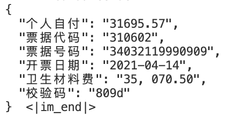

# 使用OCR引导多模态大模型输出


与专用OCR模型相比，当前多模态大模型的识字能力相对较弱。直接使用多模态大模型做视觉信息抽取往往会出现错字。**本项目使用OCR结果来引导多模态大模型输出，以期得到更高的信息抽取准确率。** 算法详情见[博客](https://zhuanlan.zhihu.com/p/7783443583)

**使用Qwen2VL-2B的例子**

||prompt|answer|
|---|---|---|
|Origin|请给出图中的个人自付、票据代码、票据号码、开票日期、卫生材料费和校验码，以json格式输出答案，不要输出多余内容||
|OCR Guided|请给出图中的个人自付、票据代码、票据号码、开票日期、卫生材料费和校验码，以json格式输出答案，不要输出多余内容||

## 安装
```python
git clone https://github.com/hzauzxb/guidance-ocr.git
cd guidance_ocr
pip3 install .
```

## 使用方法
本项目提供两种不同的引导生成模型，分别为**json结构化引导生成**和**非结构化引导生成**。

### Json 结构化引导生成
json 结构化引导生成适用于一次性抽取多个字段，可以直接生成json字符串，且保证不会输出多余内容。
```python
from guidance_ocr import get_json_processor

model = AutoModel.from_pretrained(XXX)
tokenizer = AutoTokenizer.from_pretrained(XXX)

...

logit_processor = get_json_processor(
    text_list = text_list,                           # OCR识别出来的文字
    extract_keys = ['个人自付', '票据代码', '校验码'],  # 需要抽取的字段
    tokenizer = tokenizer,                          # 模型的tokenizer
    top_k = 50,                                     # 生成时使用的top_k参数，建议设置在50-100的范围内
    model_type = 'qwen2vl',                         # 模型类型, 目前支持的模型类型见下一节
    eos_id = 151645                                 # 模型的结束生成ID
)
generated_ids = model.generate(
    **inputs,
    logits_processor = [logit_processor],
    max_new_tokens=128
)
print(tokenizer.decode(generated_ids[0]))

```
|prompt|answer|
|-|-----|
|请给出图中的个人自付、票据代码、票据号码、开票日期、卫生材料费和校验码，以json格式输出答案，不要输出多余内容||

完整示例代码见`./examples/qwen2vl/qwen2vl_json.py`

**Tips**：在写prompt时，需给出需要抽取的字段，并强调以json格式输出结果，不要输出多余内容

----

### 非结构化引导生成
非结构化引导生成适用于一次抽取一个字段，保证只输出信息抽取结果。
```python
from guidance_ocr import get_ocr_processor

model = AutoModel.from_pretrained(XXX)
tokenizer = AutoTokenizer.from_pretrained(XXX)

...

logit_processor = get_ocr_processor(
    text_list = text_list,                           # OCR识别出来的文字
    tokenizer = tokenizer,                          # 模型的tokenizer
    top_k = 50,                                     # 生成时使用的top_k参数，建议设置在50-100的范围内
    eos_id = 151645                                 # 模型的结束生成ID
)
generated_ids = model.generate(
    **inputs,
    logits_processor = [logit_processor],
    max_new_tokens=128
)
print(tokenizer.decode(generated_ids[0]))

```
|prompt|answer|
|-|-----|
|请给出图中的个人自付，只需输出答案不要输出多余内容|31695.57<&#124;im_end&#124;>|

完整示例代码见`./examples/qwen2vl/qwen2vl_ocr.py`

**Tips**：在写prompt时，需给出需要抽取的字段，并强调只输出结果，不要输出多余内容

## 支持的模型
```
qwen2vl:
Qwen/Qwen2-VL-2B-Instruct
Qwen/Qwen2-VL-7B-Instruct
Qwen/Qwen2-VL-72B-Instruct

后续计划支持
InternVL2；DeepSeekVL2
```
若有其他需支持的模型可以提issue

## 支持多种常见的信息抽取样式

|情况说明|需抽取的字段|图片|是否支持|
|---|---|---|---|
|需抽取的字段横跨多个文本框|住址||支持|
|需抽取的字段是文本框中的某一段|住宅用地使用起期||支持|

若有其他需支持的样式请提issue

## 算法原理

1. 基于OCR识别出的文字构建一套规则引擎
2. 在大模型每次给出next-token的logit时，基于规则引擎和预先设定的top_k过滤掉一批token_id
3. 选择概率最大的token_id作为本次生成的next-token
4. 基于生成的next-token更新规则引擎
5. 重复上述2-4步直到输出eos_id 或 步骤2中所有token均被过滤掉

详细解析请参考我们的[博客](https://zhuanlan.zhihu.com/p/7783443583)

## 推理加速
支持vllm框架进行推理加速, 实现代码如下
```python
from vllm import LLM, SamplingParams
from guidance_ocr import get_ocr_processor

model = LLM(
    model=model_path,
    max_model_len=4096,
    max_num_seqs=5,
    # Note - mm_processor_kwargs can also be passed to generate/chat calls
    mm_processor_kwargs={
        "min_pixels": 28 * 28,
        "max_pixels": 1280 * 28 * 28,
    },
)

...

logit_processor = get_ocr_processor(
    text_list = text_list,                           # OCR识别出来的文字
    tokenizer = tokenizer,                          # 模型的tokenizer
    top_k = 50,                                     # 生成时使用的top_k参数，建议设置在50-100的范围内
    eos_id = 151645                                 # 模型的结束生成ID
)

sampling_params = SamplingParams(
    temperature=0.2,
    max_tokens=128,
    stop_token_ids=None,
    logits_processors = [logit_processor] # 这里放我们的logit_processor
)
inputs = {
    "prompt": prompt,
    "multi_modal_data": {
        "image": data
    },
}


outputs = model.generate(inputs, sampling_params=sampling_params)

for o in outputs:
    generated_text = o.outputs[0].text
    print(generated_text)
```
完整示例代码见`./examples/qwen2vl/qwen2vl_json_vllm.py`, `./examples/qwen2vl/qwen2vl_ocr_vllm.py`(支持batch-decode)

支持基于transformers + 投机采样的推理加速
```python
from transformers import Qwen2VLForConditionalGeneration, AutoTokenizer, AutoProcessor, AutoConfig
from guidance_ocr import get_json_processor, JsonAssistModel

model_path = '/workspace/model_weights/qwen2vl_2B'

model = Qwen2VLForConditionalGeneration.from_pretrained(
    model_path, torch_dtype="auto", device_map="auto"
)

assist_model = JsonAssistModel(
    text_list = text_list,
    extract_keys = ['个人自付', '票据代码', '票据号码', '开票日期', '卫生材料费', '校验码'], # 需抽取的字段
    model_path = model_path,
    model = model,
    model_type = 'qwen2vl'
)

logit_processor = get_ocr_processor(
    text_list = text_list,                           # OCR识别出来的文字
    tokenizer = tokenizer,                          # 模型的tokenizer
    top_k = 50,                                     # 生成时使用的top_k参数，建议设置在50-100的范围内
    eos_id = 151645                                 # 模型的结束生成ID
)

...

generated_ids = model.generate(
        **inputs,
        logits_processor = [logit_processor],
        max_new_tokens=128,
        assistant_model = assist_model
    )
```
完整示例代码见`./examples/qwen2vl/qwen2vl_json_spec.py`

## 缺陷与解决方案

### 缺陷
当步骤2中所有token均被过滤掉时，生成过程会突然结束
* 若使用**json结构化引导生成**会导致生成的字符串无法使用json解析；
* 若使用**非结构化引导生成**会导致信息抽取结果不全

### 原因
任务难度超出了模型的能力范围，通常是来自以下三个原因
* 图片分辨率过小，文字模糊不清或被遮挡；
* 图片中的文字结构过于复杂(复杂表格)；
* 需抽取的字段较难理解(在表格中存在多级结构)。

此时就算使用模型原生的generate方法，也难以得到正确答案。

### 解决方法
* 考虑使用更大的模型如Qwen2VL-72B；
* 在一张图片上抽取多个字段时，尝试使用非结构化引导生成，通过多次调用降低任务难度。
